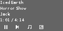
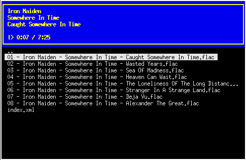
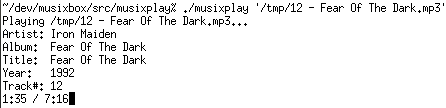
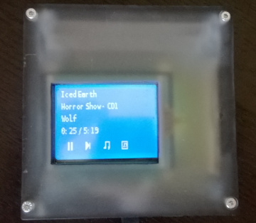

# musixbox

The MusiXBox project is my attempt to create an easy-to-use yet powerful music player. It consists of a library, musixbox, capable of playing music in a variety of input formats and output providers and several frontends: musixplay which is just a command line player, musixbox which is a minimal SDL client and musixcurses which is a ncurses-based client. The currently supported input providers are:

* AdLib (using adplug)
* Amiga Modules (using mikmod)
* Commodore 64 SID files (using libsidplay2)
* FLAC (using libFLAC++)
* MIDI (using SDL_mixer)
* MP3 (using libmad or libmpg123)
* Ogg Vorbis (using libogg, libvorbis and libvorbisfile)

Information on an input file (i.e. title, artist and album) can be obtained as well. Output can be handled provided using:

 * ALSA
 * libao
 * OSS

Software volume control can be used if desired.

## Screenshots

musixbox, minimalistic UI designed for small touchscreens:

musixcurses, ncurses-based general UI:

musixplay, command-line player:

## Hardware frontend support

Originally, the <i>musixbox</i> player frontend was intended to handle interactions using a touchscreen 320x160 LCD display connected using an AVR as a serial port. The schematics and code are available at [GitHub](https://github.com/zhmu/hardware/tree/master/musixbox-ui). Note that a SDL input provider is available which mimics the hardware.

The hardware looks like this (I didn't design the enclosure, it was made by a neighbour at the time):

